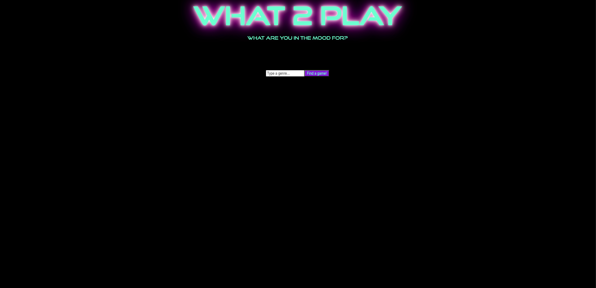
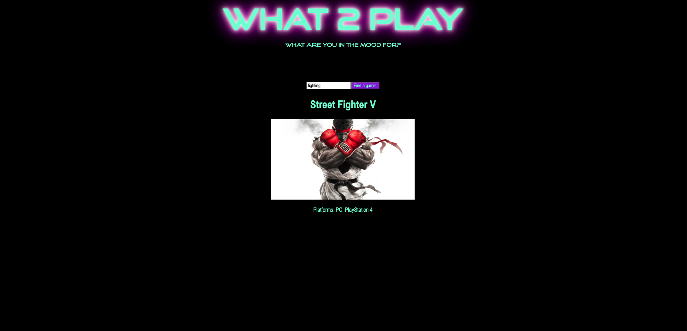

What2Play
---------

What is it?: What2Play is a web based app that gives users a randomized game suggestion based on the genre they're in the mood for! 
Technologies used: This app is built using HTML, CSS, JavaScript, AJAX and jQuery. 
Screenshots: 

Getting started: https://what2play.netlify.app
Check out the app and try a few genres, i.e. shooter, fighting, rpg, indie, etc.!

Future enhancements:  
                     1. Add multiple input fields to narrow down a more specific type of game.  
                     2. Use dropdown menus to eliminate user input errors. 
                     3. Allow users to sync gaming accounts and filter by games they already own.